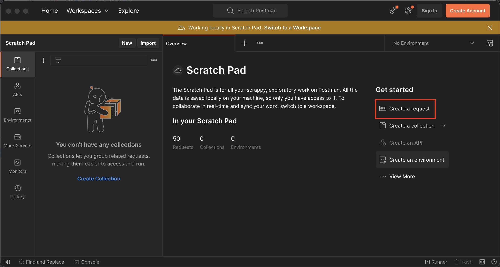

# APIs for data ingestion

## Running the repository
1. Clone the repository using `git clone <repo name>`
2. Run following commands
   1. `sudo apt-get install python3`
   2. `sudo apt install python3-pip`
   3. `python3 -m pip install --user virtualenv`
   4. `python3 -m venv assessment`
   5. `source assessment/bin/activate`
   6. `pip install -r requirements.txt`
   7. `python3 files.py`
   8. `python3 app.py`

## Requirements
* python 3 and above
* Flask 2.2.2
* openpyxl 3.0.10
* Postman

## Postman
Follow download and installation process in https://www.postman.com/downloads/
Creation of free account is not necessary

### Steps to send requests
1. Create a new request 
2. Select request type as `POST`, add the url from the server (usually `http://127.0.0.1:5000/add`) 
3. Add input json as the `Body` of the request using `raw` as a selection 
4. Press `SEND`

### Sample Input Json

```angular2html
{
    "accountSummaries":
        {
            "accountNumber": "123123123",
            "accountType": "Deposit",
            "bankName": "sbi",
            "IFSC": "sbin0000",
            "status": "Active"
        },
    "profiles":
        {
            "name": "asdf",
            "dob": "2345",
            "mobile": "0000000000",
            "address": "asdfasdf",
            "email": "asdf@asdf.com",
            "pan": "1231231231"
        },

    "transactions":
        {
            "type": "DEBIT",
            "amount": "Deposit",
            "txnDate": "23232323",
            "narration": "asdfasdfadsfasd"
        }

}
```

## Results
### Response on Postman


### Data Strored in File
